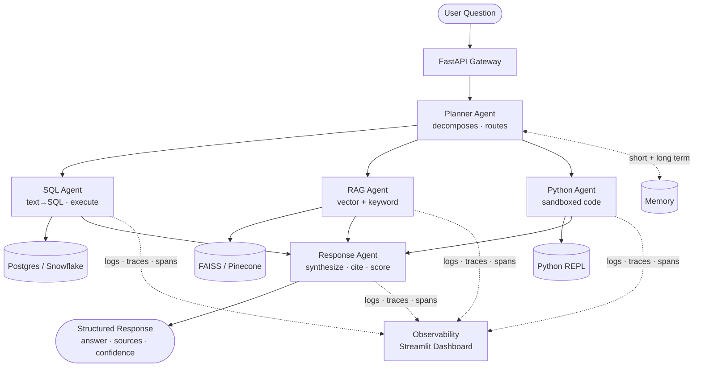

# Enterprise AI Agent Platform

> Multi-agent orchestration system for enterprise analytics — combining RAG, SQL reasoning, Python execution, and full observability into a production-ready AI backbone.

[](https://python.org)
[](https://fastapi.tiangolo.com)
[](https://langchain-ai.github.io/langgraph/)
[](https://docker.com)

---

## What This Does

A user asks: **"Why did revenue drop last quarter?"**

The platform handles the entire reasoning chain autonomously:

```
User query
   │
   ▼
Planner Agent      ← breaks question into sub-tasks
   │
   ├──► SQL Agent      ← queries Postgres/Snowflake for raw metrics
   ├──► RAG Agent      ← fetches relevant business docs / reports
   └──► Python Agent   ← runs statistical analysis, detects anomalies
                │
                ▼
         Response Agent  ← synthesizes findings into a clear answer
                │
                ▼
       [Structured Response + Sources + Confidence Score]
```

Every step is **traced, logged, and observable** via the built-in dashboard.

---
## Architecture



## Core Features

### 1. Multi-Agent Orchestration (LangGraph)
- **Planner Agent** — decomposes complex questions into sub-tasks, routes to the right specialist
- **SQL Agent** — generates and executes SQL queries with schema awareness and retry logic
- **RAG Agent** — hybrid search (vector + keyword) over embedded document corpus
- **Python Agent** — sandboxed code execution for statistical analysis
- **Response Agent** — synthesizes outputs into coherent, cited answers

### 2. Tool Integration
- PostgreSQL / Snowflake mock connector
- REST API caller with auth handling
- Python REPL (sandboxed via subprocess)
- File system reader for PDFs / CSVs

### 3. Memory System
- **Short-term**: conversation buffer (last N turns)
- **Long-term**: FAISS vector store with metadata filtering
- **Episodic**: per-session context summaries

### 4. Observability (Production-grade)
- Structured JSON logging (every agent step)
- OpenTelemetry-compatible trace spans
- Prompt tracking (input tokens, output tokens, latency)
- Agent decision audit trail
- Streamlit dashboard for live monitoring

---

## Tech Stack

| Layer | Technology |
|-------|-----------|
| Orchestration | LangGraph + LangChain |
| LLM | OpenAI GPT-4o / Claude 3.5 |
| Vector DB | FAISS (local) / Pinecone (cloud) |
| Relational DB | PostgreSQL + SQLAlchemy |
| API | FastAPI + Pydantic v2 |
| Observability | OpenTelemetry + Structlog |
| Containers | Docker + Docker Compose |
| UI | Streamlit |
| Testing | Pytest + pytest-asyncio |

---

## Quick Start

### Prerequisites
- Python 3.11+
- Docker & Docker Compose
- OpenAI API key (or Anthropic key)

### 1. Clone & Configure
```bash
git clone https://github.com/yourusername/enterprise-ai-agent-platform
cd enterprise-ai-agent-platform
cp .env.example .env
# Fill in your API keys in .env
```

### 2. Start Infrastructure
```bash
docker-compose up -d postgres
```

### 3. Install & Run
```bash
pip install -r requirements.txt
python scripts/seed_data.py       # load sample data & docs
uvicorn api.main:app --reload
```

### 4. Try It
```bash
curl -X POST http://localhost:8000/query \
  -H "Content-Type: application/json" \
  -d '{"question": "Why did revenue drop last quarter?"}'
```

### 5. Observability Dashboard
```bash
streamlit run observability/dashboard.py
```

---

## Project Structure

```
enterprise-ai-agent-platform/
├── agents/
│   ├── planner.py          # Orchestrator — decomposes & routes
│   ├── sql_agent.py        # SQL generation + execution
│   ├── rag_agent.py        # Vector search + retrieval
│   ├── python_agent.py     # Code execution agent
│   └── response_agent.py   # Final synthesis
├── tools/
│   ├── database.py         # DB connection + query runner
│   ├── vector_store.py     # FAISS / Pinecone interface
│   ├── code_executor.py    # Sandboxed Python REPL
│   └── api_caller.py       # HTTP tool for external APIs
├── memory/
│   ├── short_term.py       # Conversation buffer
│   └── long_term.py        # Vector memory + retrieval
├── observability/
│   ├── tracer.py           # OpenTelemetry spans
│   ├── logger.py           # Structured logging
│   ├── metrics.py          # Token + latency counters
│   └── dashboard.py        # Streamlit monitoring UI
├── core/
│   ├── graph.py            # LangGraph state machine
│   ├── state.py            # Shared agent state schema
│   └── config.py           # Settings via pydantic-settings
├── api/
│   ├── main.py             # FastAPI app
│   ├── routes.py           # /query, /health, /traces
│   └── schemas.py          # Request/response models
├── tests/
│   ├── test_agents.py
│   ├── test_tools.py
│   └── conftest.py
├── scripts/
│   └── seed_data.py        # Load sample DB + docs
├── docker-compose.yml
├── Dockerfile
├── requirements.txt
└── .env.example
```

---

## Demo Flow

**Input:**
> "Compare Q3 vs Q4 revenue by region, and check if our strategy doc mentions any planned changes."

**What happens:**
1. Planner splits into: `[sql_task, rag_task]`
2. SQL Agent queries `sales` table → returns aggregated data
3. RAG Agent searches strategy docs → finds relevant paragraphs
4. Python Agent runs trend analysis + generates chart data
5. Response Agent combines: SQL data + doc quotes + analysis → structured answer

**Output:**
```json
{
  "answer": "Revenue dropped 18% in APAC in Q4...",
  "sources": ["sales_table", "strategy_2024_q3.pdf#page=12"],
  "confidence": 0.87,
  "trace_id": "abc123",
  "steps": ["planner", "sql_agent", "rag_agent", "python_agent", "response_agent"],
  "latency_ms": 2340
}
```

---

## Resume Impact

> *"Designed and implemented a multi-agent AI platform integrating RAG, SQL querying, and tool-based execution for enterprise analytics workflows, with full observability and production-ready architecture."*

---

## Related Projects

- [github-rag-system](../github-rag-system) — RAG pipeline for GitHub repositories (predecessor project)

---

## License

MIT
