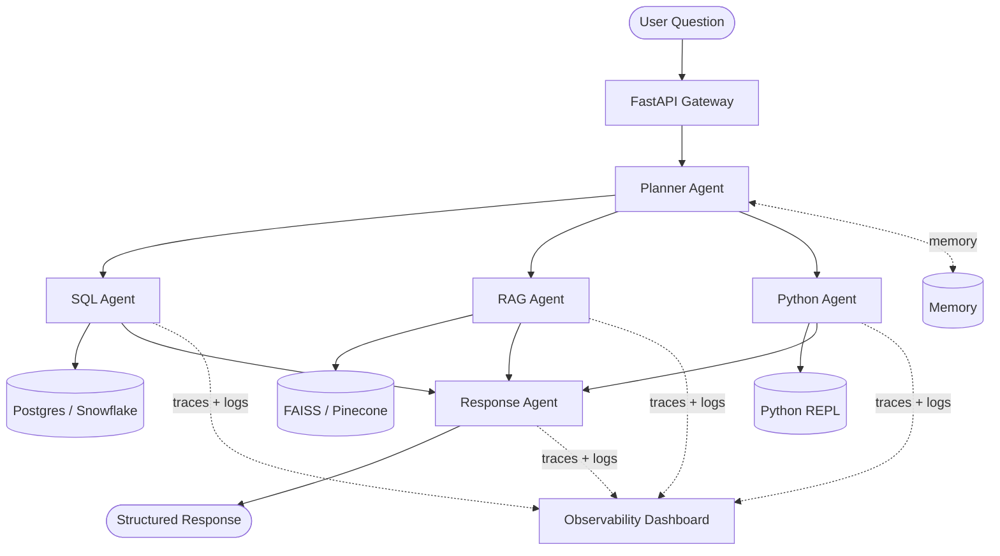

# Enterprise AI Agent Platform

> Multi-agent orchestration system for enterprise analytics — combining RAG, SQL reasoning, Python execution, and full observability into a production-ready AI backbone.

[](https://python.org)
[](https://fastapi.tiangolo.com)
[](https://langchain-ai.github.io/langgraph/)
[](https://docker.com)

---

## What This Does

A user asks: **"Why did revenue drop last quarter?"**

The platform handles the entire reasoning chain autonomously:

Every step is **traced, logged, and observable** via the built-in dashboard.

---

## Architecture


---

## Core Features

### 1. Multi-Agent Orchestration
- **Planner Agent** — decomposes questions, routes to specialists
- **SQL Agent** — generates and executes SQL with retry logic
- **RAG Agent** — hybrid vector + keyword search
- **Python Agent** — sandboxed code execution
- **Response Agent** — synthesizes cited answers

### 2. Tool Integration
- PostgreSQL / Snowflake connector
- Python REPL (sandboxed via subprocess)
- FAISS / Pinecone vector store
- REST API caller

### 3. Memory System
- **Short-term**: conversation buffer (last N turns)
- **Long-term**: FAISS vector store with metadata filtering

### 4. Observability
- Structured JSON logging
- OpenTelemetry trace spans
- Token + latency tracking
- Streamlit monitoring dashboard

---

## Tech Stack

| Layer | Technology |
|-------|-----------|
| Orchestration | LangGraph + LangChain |
| LLM | OpenAI GPT-4o / Claude 3.5 |
| Vector DB | FAISS / Pinecone |
| Relational DB | PostgreSQL + SQLAlchemy |
| API | FastAPI + Pydantic v2 |
| Observability | OpenTelemetry + Structlog |
| Containers | Docker + Docker Compose |
| UI | Streamlit |
| Testing | Pytest + pytest-asyncio |

---

## Quick Start
```bash
git clone https://github.com/mohithrangineni-de/enterprise-ai-agent-platform
cd enterprise-ai-agent-platform
cp .env.example .env
docker-compose up -d postgres
pip install -r requirements.txt
python scripts/seed_data.py
uvicorn api.main:app --reload
```

Try it:
```bash
curl -X POST http://localhost:8000/query \
  -H "Content-Type: application/json" \
  -d '{"question": "Why did revenue drop last quarter?"}'
```

---

## Demo Output
```json
{
  "answer": "Revenue dropped 18% in APAC in Q4...",
  "sources": ["sales_table", "strategy_2024_q3.pdf#page=12"],
  "confidence": 0.87,
  "trace_id": "abc123",
  "latency_ms": 2340
}
```

---

## Resume Impact

> "Designed and implemented a multi-agent AI platform integrating RAG, SQL querying, and tool-based execution for enterprise analytics workflows, with full observability and production-ready architecture."

---

## License

MIT
